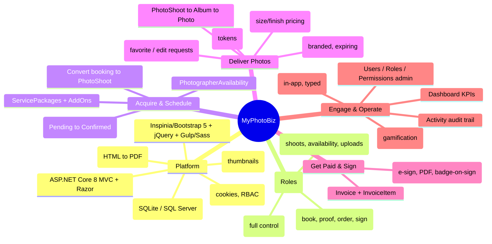
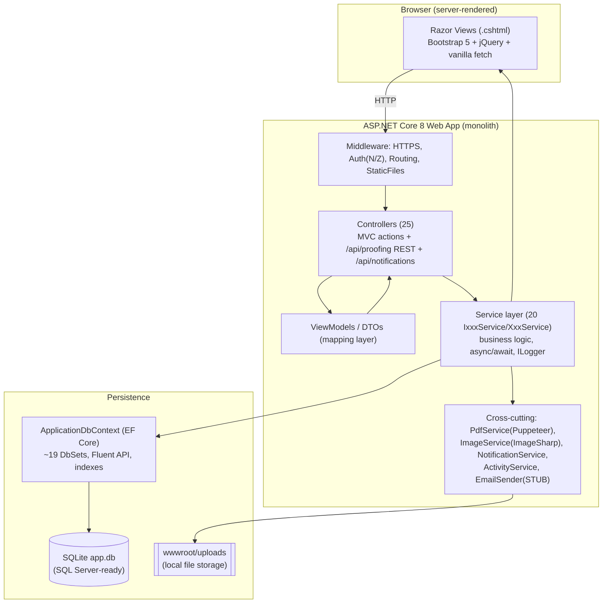
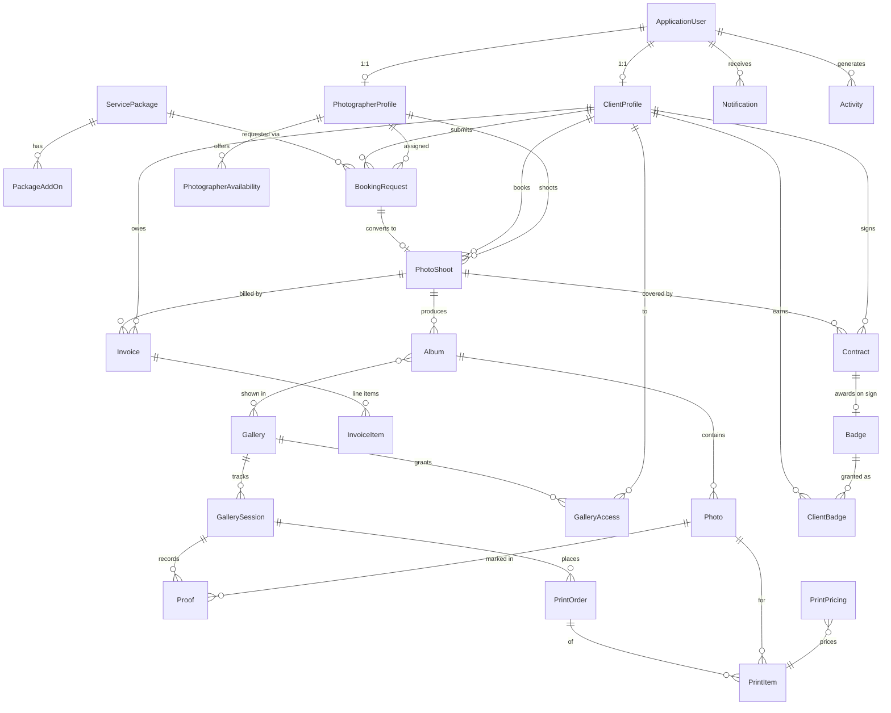

# MyPhotoBiz — Micro & Macro Analysis (Mind Map + Model)

> **What this app is, in one sentence:** MyPhotoBiz is a monolithic ASP.NET Core 8
> (C#) web application that gives a photography business one place to run its entire
> client lifecycle — from a prospect requesting a booking, through the shoot,
> photo delivery via online proofing galleries, print sales, contracts, invoicing,
> and client-engagement badges — with role-based access for **Admins**,
> **Photographers**, and **Clients**.

This document explains MyPhotoBiz at two altitudes: the **macro** (why it exists,
its architecture, and its domain) and the **micro** (how the code is organized
internally). Diagrams are written in Mermaid, which GitHub renders inline.

---

## 1. WHY this app exists (the problem it solves)

A working photographer juggles a sprawl of disconnected tools: a contact form for
inquiries, a calendar for availability, a separate gallery host (Pixieset/Pic-Time)
for delivering photos, an accounting tool for invoices, a PDF e-sign service for
contracts, and email for everything in between. Each tool is a silo; data is
re-keyed by hand and the client experience is fragmented.

**MyPhotoBiz collapses that stack into a single self-hosted application.** The
*why* behind every feature traces back to one of three goals:

1. **Run the business** — capture leads, schedule shoots, bill clients, sign
   contracts (Admin/Photographer back office).
2. **Delight & self-serve the client** — branded galleries, photo proofing
   (favoriting / requesting edits), print ordering, badges (Client front of house).
3. **Stay lightweight & portable** — SQLite file database, no external service
   dependencies required to boot, deployable on a single server.

---

## 2. MIND MAP (macro shape of the system)

---

## 3. MACRO MODEL (layered architecture)

A clean, conventional **layered MVC + service-layer monolith** (~16.5k LOC C#,
~133 Razor views, 25 controllers, 20 service pairs, 28 entity models, 37 EF
migrations). Single project, no microservices, mostly server-rendered.

**Key macro decisions & their rationale**

- **Service layer behind interfaces, registered `AddScoped` in `Program.cs`** —
  testable, swappable business logic; controllers stay thin.
- **SQLite by default, SQL Server packages also referenced** — zero-setup local
  dev + a clear production upgrade path. Monetary fields are stored as `double`
  for SQLite compatibility (a known precision trade-off).
- **Server-side PDF via headless Chrome (PuppeteerSharp)** — reuses HTML/CSS
  skills for invoice/contract documents; supports a remote Chrome endpoint via
  `CHROME_WS_ENDPOINT`.
- **In-app notifications + activity audit** stored in the DB (polled every 2 min,
  no SignalR) — simple, no real-time infrastructure needed.
- **Identity + custom Permission/RolePermission tables** — three seeded roles plus
  finer-grained permission mapping on top of RBAC.

---

## 4. DOMAIN / DATA MODEL (the "model")

The domain is organized around one spine: **BookingRequest → PhotoShoot → Album/
Photo → Gallery → Proofing → Invoice/Contract**, with the user split into
`ClientProfile` and `PhotographerProfile` (each 1:1 with the Identity
`ApplicationUser`).

**Entity glossary (grouped)**

- **Identity / people:** `ApplicationUser` (FirstName/LastName/UserType/IsActive),
  `ClientProfile`, `PhotographerProfile`, `Permission`, `RolePermission`.
- **Acquire & schedule:** `ServicePackage`, `PackageAddOn`, `BookingRequest`
  (ref `BK-yyMMdd-RRRR`, status Pending→Confirmed/Declined),
  `PhotographerAvailability` (one-time + recurring slots).
- **Production:** `PhotoShoot` (status Scheduled→InProgress→Completed), `Album`,
  `Photo`.
- **Delivery:** `Gallery` (brand color/logo, expiry), `GalleryAccess`
  (CanDownload/CanProof/CanOrder), `GallerySession` (token), `Proof`
  (IsFavorite/IsMarkedForEditing + notes).
- **Commerce:** `Invoice`/`InvoiceItem`, `PrintOrder`/`PrintItem`/`PrintPricing`.
- **Legal & engagement:** `Contract` (e-sign, PDF, award-badge-on-sign),
  `Badge`/`ClientBadge`, `Notification`, `Activity`, `FileItem`.

---

## 5. MICRO MODEL (how the code is built, internally)

- **Folder convention = layer:** `Controllers/`, `Services/` (paired
  `IXxxService.cs` + `XxxService.cs`), `Models/`, `ViewModels/`, `DTOs/`, `Data/`,
  `Enums/` (7 status enums), `Extensions/`, `Helpers/`, `Constants/`,
  `Migrations/`, `Views/{Controller}/*.cshtml`, `Areas/Identity/`
  (login/register/manage pages).
- **Patterns:** constructor dependency injection everywhere; thin controllers →
  services → EF Core (DbContext as an implicit repository); `ViewModel` mapping
  for views; pervasive `async/await` (191+ async service methods); `ILogger<T>`
  injected; null-coalescing / string-interpolation idioms.
- **API surface:** mostly classic MVC routes
  (`{controller=Home}/{action=Index}/{id?}`); one true REST controller
  `ProofingController` (`/api/proofing/*`, token-auth so clients can proof
  anonymously) and a JSON `/api/notifications/*` surface.
- **Auth:** ASP.NET Core Identity, cookie auth, 12-char strong password policy,
  3 seeded roles + `Permission`/`RolePermission`; gallery access via per-user
  `GalleryAccess` and tokenized `GallerySession` (migrated away from the old
  code/password gallery scheme).
- **Config & boot:** `Program.cs` wires the DbContext, Identity, ~18 scoped
  services, the middleware pipeline, and **seeds roles + an optional admin** from
  `AdminUser:*` configuration. `appsettings.json` holds the SQLite connection
  string. CI is GitHub Actions (`.github/workflows/ci.yml`: restore/build/test on
  .NET 8).
- **Notification subsystem** (documented in `NOTIFICATION_SYSTEM.md`): typed,
  styled, badge-counted, auto-refresh, with helper extension methods in
  `Extensions/NotificationExtensions.cs`.

**Known technical debt (called out in code TODOs):**
`PhotosController` has `[Authorize]` commented out (photos publicly reachable);
`ApplyPaymentAsync` overwrites `Invoice.Amount` (no payment history / no `Payment`
model); aggressive cascade deletes on `ClientProfile`; dual photographer FKs on
`PhotoShoot` (`PhotographerId` string + `PhotographerProfileId` int); no
soft-delete; `EmailSender` is a console stub (no real email); no payment gateway;
local-only file storage; some N+1 queries in `GalleryService`; no test project.

---

## 6. END-TO-END STORY (the "what it does," verbose)

1. **A prospect books.** They browse `ServicePackage`s, submit a `BookingRequest`
   (event type, preferred date, location, notes) which gets a human-readable
   reference. Photographer availability is modeled by `PhotographerAvailability`.
2. **The studio confirms.** An Admin/Photographer reviews the request, assigns a
   photographer, and confirms — which **converts the booking into a `PhotoShoot`**
   on the schedule (or declines with a reason).
3. **The shoot happens, photos land.** After shooting, the photographer uploads
   `Photo`s (thumbnails via ImageSharp) into `Album`s tied to the shoot.
4. **The client receives a gallery.** Albums surface in a branded, expiring
   `Gallery`. Access is granted per client via `GalleryAccess` (download / proof /
   order flags) and tracked through a tokenized `GallerySession`.
5. **The client proofs.** In the gallery they favorite photos and flag others for
   editing with notes (`Proof`), and can place a `PrintOrder` priced by size and
   finish (`PrintPricing`).
6. **The studio bills and signs.** `Invoice`s (+ line items) track payment status;
   `Contract`s are sent, e-signed, rendered to PDF (Puppeteer), and can
   auto-award a `Badge` on signing.
7. **Everyone stays in the loop.** Typed in-app `Notification`s and an `Activity`
   audit trail record what happened; a dashboard surfaces KPIs; Admins manage
   users, roles, and permissions.

---

## 7. Technology stack at a glance

| Concern        | Choice |
| -------------- | ------ |
| Language / runtime | C# on .NET 8 (`net8.0`, nullable + implicit usings) |
| Web framework  | ASP.NET Core 8 MVC + Razor Pages (server-rendered) |
| ORM / DB       | EF Core 8 → SQLite (`app.db`); SQL Server packages also referenced |
| Auth           | ASP.NET Core Identity (cookie auth), RBAC + custom permissions |
| PDF            | PuppeteerSharp 20.x (headless Chrome, HTML→PDF) |
| Images         | SixLabors.ImageSharp 3.x |
| Front-end      | Inspinia/Bootstrap 5.3, jQuery 3.7, Tabler/Lucide icons |
| Build (assets) | npm + Gulp 4 + Sass/Autoprefixer |
| CI             | GitHub Actions (`.github/workflows/ci.yml`) — restore/build/test |

---

*Generated as a codebase analysis; reflects the state of the repository at the time
of writing. Section 5's "technical debt" list mirrors TODO comments left in the
source and is informational, not a set of changes made by this document.*
